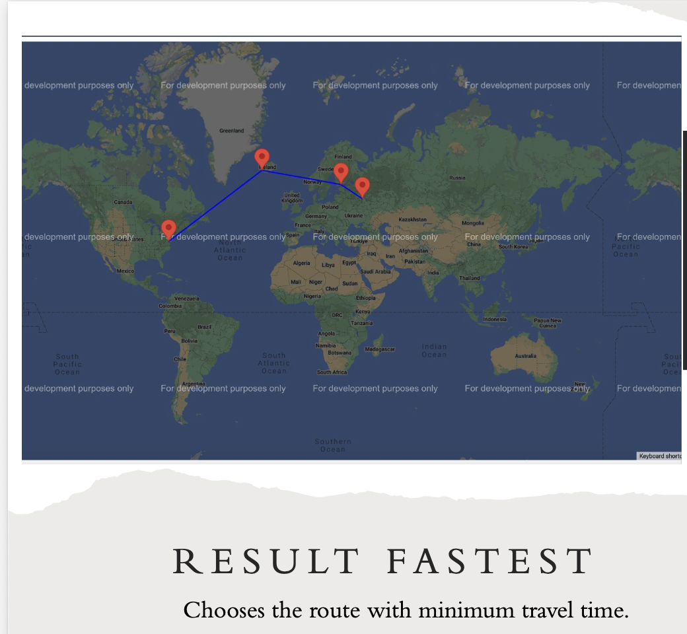

# Route Optimization Program

## Overview

This program calculates and displays the most efficient travel routes between two countries based on the user's preference for either **fastest** or **cheapest** travel options. The routes are generated based on data from CSV files containing city and route information.

## Features

- **Fastest Route Calculation**: Finds the route that minimizes travel time.
- **Cheapest Route Calculation**: Finds the route that minimizes travel cost.
- Outputs the selected route in a visual format on a world map.
- Supports input from CSV files for cities and routes.

## Usage

To run the program, follow these steps:

1. **Input CSV Files**: You will need two CSV files:
   - **Cities file**: Contains a list of cities with their respective coordinates.
   - **Routes file**: Contains a list of possible routes between these cities, along with travel time and cost information.

2. **Command-Line Interface**: When running the program, you will be prompted to:
   - Enter the file paths for the cities and routes CSV files.
   - Specify the name for the output HTML file.
   - Input the origin and destination countries.
   - Choose your route preference (either `fastest` or `cheapest`).

### Example Run

```bash
Enter filename containing cities: /path/to/cities.csv
Enter filename containing routes: /path/to/routes.csv
Enter filename for output (.html): output.html
Origin Country name: Bangladesh
Destination Country name: Canada
Enter a preference (fastest/cheapest): cheapest
```

3. **Output**: After the process completes, an HTML file is generated (in this case, `output.html`). This file contains a visual representation of the calculated route on a world map, showing either the fastest or cheapest route.

## Screenshots

### Fastest Route Example


### Cheapest Route Example


## File Structure

The program expects the following structure:

```
project/
│
├── src/
│   ├── cities.csv      # CSV containing city data
│   ├── routes.csv      # CSV containing route data
│   ├── FileOperations.java      
│   ├── Graph.csv    
│   ├── Main.csv     
│   ├── Route.csv     
│   ├── Location.csv     
│
└── output/
    ├── result.html     # Generated output file with the route map
```

## Dependencies

- **Python 3.x**
- Libraries:
  - `pandas` for CSV handling
  - `geopy` for geographic calculations (optional for city data)
  - `folium` for generating the route maps in HTML format

## How it Works

1. The program first parses the cities and routes from the provided CSV files.
2. Based on the user's choice (fastest or cheapest), it calculates the optimal route.
3. The selected route is then visualized on a map and saved in an HTML file, which can be opened in a browser.

## License

This project is licensed under the MIT License - see the LICENSE file for details.
